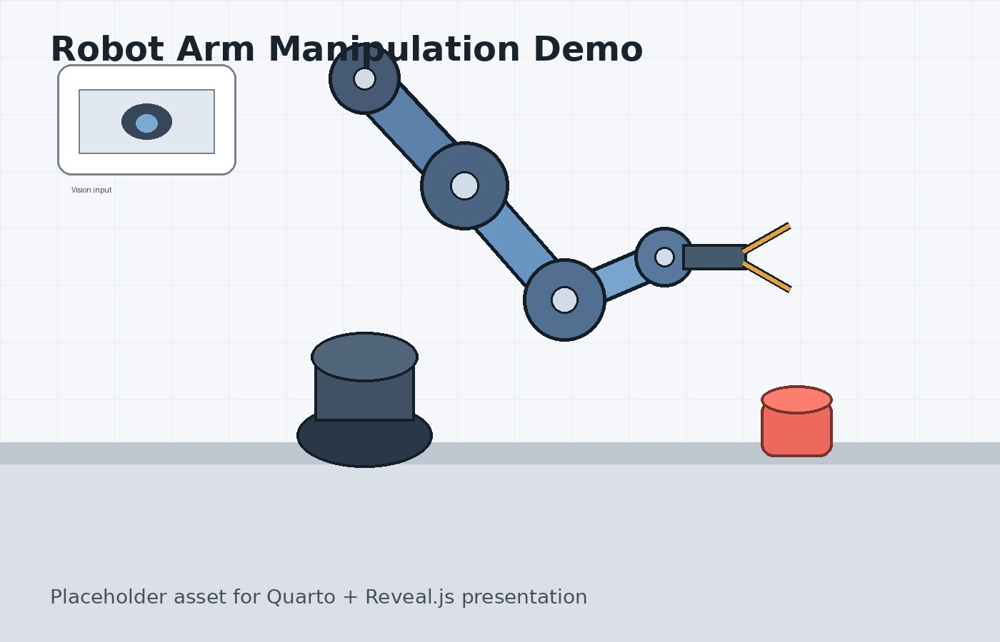

# 机械臂前沿技术

## 从“会动”到“会操作”

本报告关注三个问题：

- 机械臂如何从人工编程走向模仿学习？
- ACT 和 Diffusion Policy 为什么重要？
- VLA 和机器人基础模型代表什么趋势？

---

# 一张照片示例

## 机械臂操作场景

{width=75%}

---

# 一个视频示例

## 真实机器人操作演示

<video src="videos/robot-demo.mp4" controls width="900"></video>

---

# ACT

## Action Chunking Transformer

ACT 的核心思想是一次预测一段动作，而不是每次只预测一个动作。

$$
a_{t:t+k} = \pi_\theta(o_t)
$$

---

# Diffusion Policy

## 扩散策略

Diffusion Policy 把机械臂动作序列看作条件生成过程：

$$
p_\theta(a_{0:H} \mid o)
$$

```text
随机噪声动作序列
        ↓
逐步去噪
        ↓
可执行的机械臂轨迹
```

---

# ACT vs Diffusion Policy {.compact}

## 两种策略的核心区别

::: {.columns}

:::: {.column width="50%"}

### ACT

**核心思想**

一次预测一段动作：

$$
a_{t:t+k} = \pi_\theta(o_t)
$$

**适合场景**

- 低成本双臂操作
- 短时程精细任务
- 遥操作数据模仿学习

::::

:::: {.column width="50%"}

### Diffusion Policy

**核心思想**

从噪声中生成动作轨迹：

$$
p_\theta(a_{0:H} \mid o)
$$

**适合场景**

- 多模态动作分布
- 复杂操作轨迹
- 对动作平滑性要求较高的任务

::::

:::

---

# 视频背景示例 {background-video="videos/robot-demo.mp4" background-video-loop="true" background-video-muted="true"}

::: {.overlay-box}
从人工编程到模仿学习，核心变化是：

**机器人不再只执行人写好的规则，而是从数据中学习动作策略。**
:::

---

# 总结

## 一句话结论

ACT 和 Diffusion Policy 是机械臂低层动作策略的代表性前沿。

VLA 和机器人基础模型则代表更宏观的通用机器人智能方向。